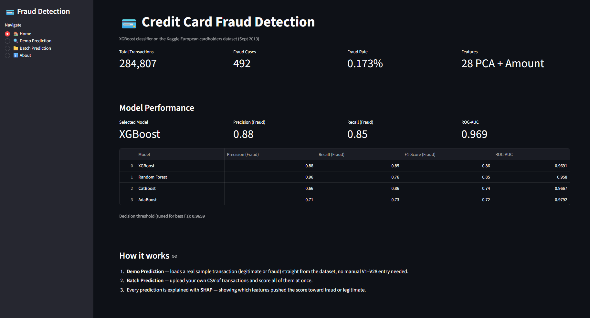
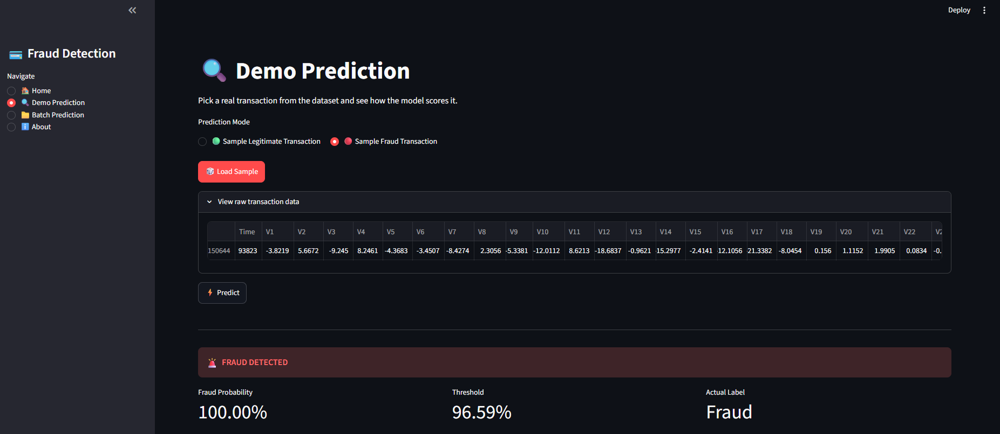
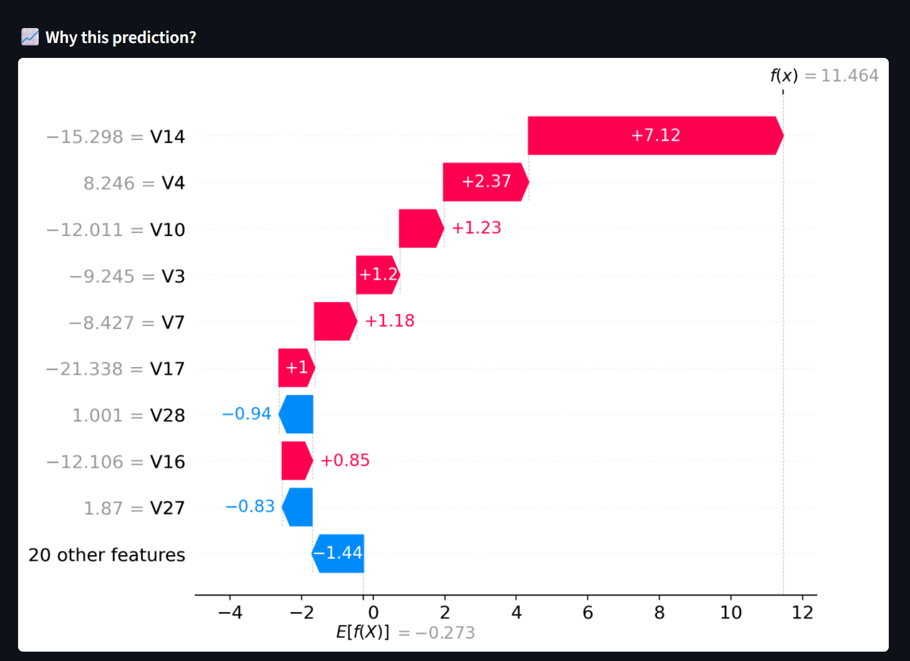
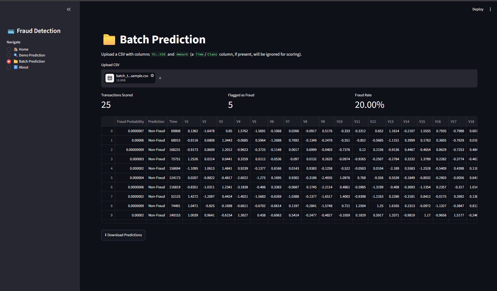
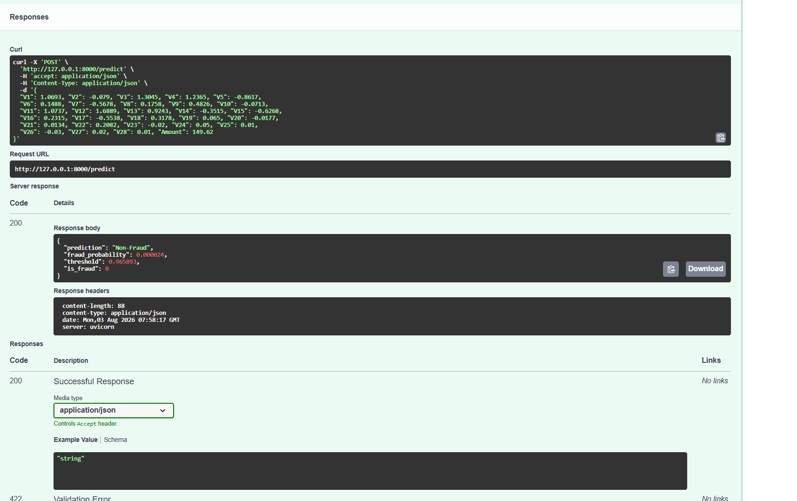

# 💳 Credit Card Fraud Detection

End-to-end machine learning project detecting fraudulent credit card transactions on the
classic Kaggle "creditcard.csv" dataset — from EDA and model comparison to a deployed,
explainable, interactive dashboard and API.

**Live Demo:** _add your deployed Streamlit link here_
**API Docs:** _add your deployed FastAPI `/docs` link here (if hosted)_



---

## 📌 Problem Statement

Credit card fraud detection is a textbook **imbalanced classification** problem: fraud is rare
(0.17% of transactions here), but missing it is costly, and flagging too many legitimate
transactions frustrates customers. This project builds a model that finds the right balance —
and makes that trade-off visible and explainable, not a black box.

## 📊 Dataset

- **Source:** [Kaggle — Credit Card Fraud Detection](https://www.kaggle.com/datasets/mlg-ulb/creditcardfraud)
- **284,807** transactions by European cardholders over 2 days in September 2013
- **492 frauds (0.172%)** — highly imbalanced
- Features `V1`–`V28` are PCA-transformed (original features withheld for confidentiality);
  `Time` and `Amount` are the only untransformed columns

## 🔍 Exploratory Data Analysis

- Confirmed no missing values across all 284,807 rows
- Analyzed fraud patterns by hour of day — fraud rate spikes during specific low-traffic windows
- Compared transaction amount distributions between fraud and legitimate transactions
  (fraud amounts are more volatile and right-skewed)
- Correlation analysis identified `V17`, `V14`, `V12`, and `V10` as the PCA components most
  associated with fraud

## 🤖 Modeling

Trained and compared four classifiers, all with class-imbalance handling
(`class_weight='balanced'`, `scale_pos_weight`, or `auto_class_weights`):

| Model         | Precision (Fraud) | Recall (Fraud) | F1-Score (Fraud) | ROC-AUC |
|---------------|:---:|:---:|:---:|:---:|
| **XGBoost**   | 0.88 | 0.85 | **0.86** | 0.9691 |
| Random Forest | 0.96 | 0.76 | 0.85 | 0.9580 |
| CatBoost      | 0.66 | 0.86 | 0.74 | 0.9667 |
| AdaBoost      | 0.71 | 0.73 | 0.72 | 0.9792 |

**XGBoost selected** for the best F1-score on the fraud class — the strongest balance of
catching fraud without over-flagging legitimate transactions.

**Threshold tuning:** rather than using the default 0.5 cutoff, the decision threshold was
tuned against the precision-recall curve to maximize F1-score, landing at **≈0.966** — reflecting
just how confidently the model needs to flag a transaction before acting on it.

## 🖥️ Dashboard (Streamlit)

A four-page interactive dashboard:

| Page | What it does |
|---|---|
| 🏠 **Home** | Dataset stats, model comparison table, selected model + threshold |
| 🔍 **Demo Prediction** | Loads a *real* sample transaction (legit or fraud) from the dataset — no manual V1–V28 entry — and shows the prediction with a SHAP explanation |
| 📁 **Batch Prediction** | Upload a CSV, score every row, download results |
| ℹ️ **About** | Project summary, tech stack, links |

**Demo Prediction — a real fraud transaction, correctly caught:**



## 🧠 Explainability

Every prediction is explained with **SHAP** (TreeExplainer) — a per-transaction waterfall plot
shows exactly which features pushed the score toward fraud or legitimate, and by how much.

In the example above, `V14` is the dominant signal pushing this transaction toward fraud:



**Batch scoring — upload any CSV, get predictions for every row:**



## ⚡ API (FastAPI)

A companion REST API serves the same model for programmatic access:

- `GET /` — health check + model info
- `POST /predict` — score a single transaction (29 fields: `V1`–`V28`, `Amount`)

Interactive docs auto-generated at `/docs` (Swagger UI):



**Example request:**
```bash
curl -X POST "http://127.0.0.1:8000/predict" \
  -H "Content-Type: application/json" \
  -d '{"V1": 1.0693, "V2": -0.079, "V3": 1.3045, "V4": 1.2365, "V5": -0.8617,
       "V6": 0.1488, "V7": -0.5678, "V8": 0.1758, "V9": 0.4826, "V10": -0.0713,
       "V11": 1.0737, "V12": 1.6889, "V13": 0.9243, "V14": -0.3515, "V15": -0.6268,
       "V16": 0.2315, "V17": -0.5538, "V18": 0.3178, "V19": 0.065, "V20": -0.0177,
       "V21": 0.0134, "V22": 0.2082, "V23": 0.0, "V24": 0.0, "V25": 0.0,
       "V26": 0.0, "V27": 0.0, "V28": 0.0, "Amount": 149.62}'
```

**Example response:**
```json
{
  "prediction": "Non-Fraud",
  "fraud_probability": 0.000002,
  "threshold": 0.965893,
  "is_fraud": 0
}
```

## 🛠️ Tech Stack

- **Modeling:** scikit-learn, XGBoost, CatBoost, AdaBoost (compared), imbalanced-learn techniques
- **Explainability:** SHAP
- **Dashboard:** Streamlit
- **API:** FastAPI, Pydantic, Uvicorn
- **Data handling:** pandas, NumPy
- **Visualization:** Matplotlib, Seaborn

## 📁 Project Structure

```
Credit Fraud Detection/
├── app.py                  # FastAPI service
├── streamlit_app.py        # Streamlit dashboard
├── main.ipynb              # EDA, modeling, evaluation notebook
├── creditcard.csv           # Dataset (not included in repo — see Setup)
├── xgb_fraud_model.pkl      # Trained XGBoost model
├── robust_scaler.pkl        # Fitted RobustScaler (Amount)
├── threshold.pkl            # Tuned decision threshold
├── screenshots/             # README images
└── requirements.txt
```

## 🚀 Setup & Running Locally

```bash
# 1. Clone the repo
git clone https://github.com/Gudurupavankumarreddy/Credit-Card-Fraud-Detection.git
cd Credit-Card-Fraud-Detection

# 2. Install dependencies
pip install -r requirements.txt

# 3. Download the dataset
# Get creditcard.csv from https://www.kaggle.com/datasets/mlg-ulb/creditcardfraud
# and place it in the project root

# 4. Run the Streamlit dashboard
streamlit run streamlit_app.py

# 5. Run the FastAPI service (separate terminal)
python app.py
# Opens http://127.0.0.1:8000/docs automatically
```

## 📈 Results Summary

- **86% F1-score** on the fraud class with **96.9% ROC-AUC**
- Tuned threshold balances precision and recall rather than defaulting to 0.5
- Fully explainable predictions via SHAP — no black-box decisions
- Deployed as both an interactive dashboard and a programmatic API

## 🔮 Future Improvements

- Deploy both services publicly (Streamlit Community Cloud + a hosted API)
- Wire the Streamlit dashboard to call the FastAPI endpoint instead of loading the model directly
- Add a `/predict_batch` endpoint to the API for programmatic batch scoring
- Add automated tests for the prediction pipeline

## 🔗 Links

- **GitHub:** [github.com/Gudurupavankumarreddy](https://github.com/Gudurupavankumarreddy)
- **Portfolio:** [pavan-data-portfolio.netlify.app](https://pavan-data-portfolio.netlify.app)
